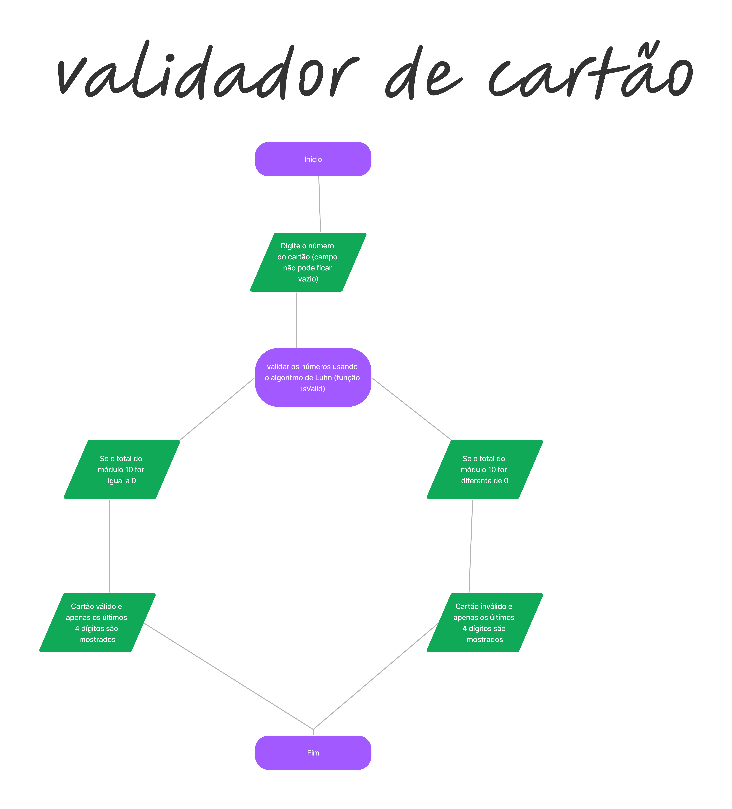

# Cartão de Crédito Válido

## Índice

* [1. Descrição](#1-Descrição)
* [2. Pseudo código](#2-Pseudo-código)
* [3. Como usar o validador de cartão de crédito](#3-Como-usar-o-validador-de-cartão-de-crédito)
* [4. Benefícios de usar um validador de cartão de crédito](#4-Benefícios-de-usar-um-validador-de-cartão-de-crédito)
* [5. Contato](#5-Contato)
* [6. Link do projeto](#6-link-do-projeto)

***

## 1. Descrição

Valini é um validador de número de cartão de crédito, usado principalmente em lojas online ou por pessoas que querem saber se possuem um cartão de crédito válido ou não.

Essa ferramenta útil é encontrada online e realiza a validação por meio do algoritmo LUHN.

O [algoritmo de Luhn](https://en.wikipedia.org/wiki/Luhn_algorithm), também
chamado de módulo 10, é um método de soma de verificação, usado para validar
números de identificação, como o IMEI de telefones celulares, cartões de crédito
etc.

## 2. pseudo-código

Descrição
* Digite o número do cartão de crédito (este campo não pode ficar vazio)

* Se a condição for atendida, implemente o algoritmo de Luhn. Para gerar o dígito de verificação usando o algoritmo de Luhn, os seguintes passos devem ser seguidos:

Em uma determinada sequência de dígitos, o dígito de verificação será o último valor, que é desconhecido em princípio

A partir dessa última posição, multiplique cada dígito na posição par (contando da direita) por dois. Se o resultado for um número de dois dígitos, esses dois valores serão adicionados

Posteriormente, todos os dígitos obtidos são adicionados

O dígito de verificação é o número que se obtém como resto depois de dividir esse resultado por 10 (que é o que em matemática se chama mod-10).

* Se o total do módulo 10 for igual a 0, o número do cartão é válido, caso contrário, é inválido.

* Ao exibir o resultado de cada validação, os números devem ser mascarados

[fluxograma de pseudocódigo] 

## 3. Como usar o validador de cartão de crédito

Para usar este validador de cartão de crédito, basta seguir os passos abaixo e você poderá validar qualquer número de cartão de crédito.

Passo 1: insira o número do seu cartão de crédito no campo de entrada. Certifique-se de que não haja espaços ou hífens entre os números.Passo 2: Clique no botão "VALIDAR" e a ferramenta de validação do cartão de crédito fará o resto.

## 4. Usos de um validador de cartão de crédito

Existem várias razões pelas quais você pode querer usar um validador de cartão de crédito. Alguns dos motivos mais comuns são:

* Para verificar se um número de cartão de crédito é válido: Você pode usar um validador de cartão de crédito para verificar se um número de cartão de crédito é válido. Isso é útil se você estiver tentando verificar se um número de cartão de crédito está correto.

* Para verificar o algoritmo Luhn: Você pode usar um validador de cartão de crédito para verificar o algoritmo Luhn. Isso é útil se você quiser garantir que um número de cartão de crédito esteja no formato correto. Se a verificação do algoritmo Luhn falhar, isso significa que o número do cartão de crédito é inválido.

* Para garantir um processamento de pagamento tranquilo: Você pode usar um validador de cartão de crédito para garantir um processamento de pagamento tranquilo. Isso porque pode ajudá-lo a formatar o número do cartão de crédito corretamente. Isso pode ajudar a reduzir as chances de erros/fraude durante o processamento do pagamento.

## 5. Contato

ncontreraskanan@gmail.com

## 6. Link do projeto

https://niel0503.github.io/SAP010-card-validation/